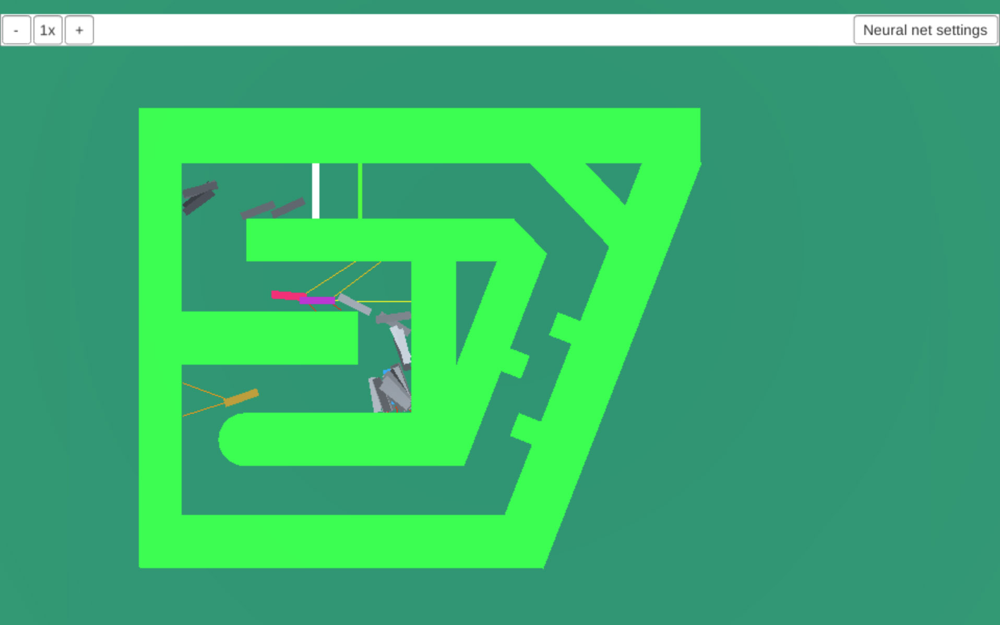

# NeuralNetworksSteering
NN with GA that teaches blocks to drive through a maze. 

>This project was done back in the days. As a high scooler I did not have any formal programming education. Expect some spaghetti code.

## Live demo
Compiled WEBGL build is available at:

[http://stoked.cz/projects/NeuralNetworkSteering/index.html](http://stoked.cz/projects/NeuralNetworkSteering/index.html)

## Usage 
- Hold right mouse key to move around.
- Start by clicking the "Neural Net Settings" button and adjust the settings. Click generate to create the first generation.
- Buttons in the left top corner are used to slow/pause/speed up the simulation speed.
- Click the block to view its current neural net.

## About
### Neural network
The block learns to drive through the maze. It has 3 inputs, user defined number of hidden layers and 2 outpus (steering angle + speed).

### Genetic algorithm
The blocks are bred using a GA. The fitness is calculated by how far the block drives through the maze. If the block reaches the start line, it gets a massive fitness boost. Parents are selected using a roullette wheel selection. The breeding is done using an one point crossover and swapping neuron weighta with the other parent. The mutation happens by adjusting a neuron's weight on a gaussian curve (small changes happen way more often than big ones).

